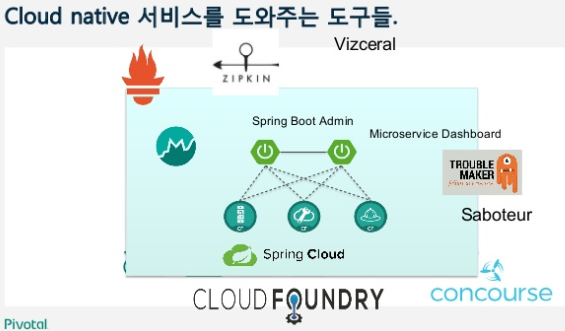

# Cloud Native 서비스를 도와주는 도구들

## Cloud Native 시스템 운영을 위한 도구 요구사항

### Dev

* 앱 자동배포
* MSA를 위한 기반 서비스 
* On-demand backing service
* 실시간 모니터링 
* 중앙집중형 통합로그 

### Ops

* VM, 로드밸런서, IP관리 자동화 
* 플랫폼 설치 자동화
* App, VM,AZ까지의 고가용성 
* 플랫폼/서비스 통합 모니터링 
* 중앙집중형 통합로그 
* Autoscaling 
* 플랫폼 무중단 업데이트 
* 신속한 보안패치 
* 컨테이너 보안 
* Credentials 관리및 rotate 운영자의 안정성

## MSA 기반 서비스

## Spring boot Actuator

* __Spring boot 기반 앱의 모니터링과 관리를 위한 라이브러리__

* 예)  `/actuator/health` endpoint의 경우, 어플리케이션의 health와 관련된 정보를 줌.

  ~~~JSON
  {
      "status" : "UP"
  }
  ~~~

* endpoint 종류 : health, info, metrics 등 다양한 엔드 포인트 제공

  * auditevents
  * beans
  * conditions
  * configprops
  * env
  * flyway
  * health
  * httptrace
  * info
  * loggers
  * liquibase
  * metrics
  * mappings
  * scheduledtasks
  * sessions
  * shutdown
  * threaddump

* 사용 방법

  * 참고 링크 : https://docs.spring.io/spring-boot/docs/current/reference/htmlsingle/#production-ready

  * Maven이나 Gradle

    * 예)

      ~~~XML
      <dependencies>
      	<dependency>
      		<groupId>org.springframework.boot</groupId>
      		<artifactId>spring-boot-starter-actuator</artifactId>
      	</dependency>
      </dependencies>
      ~~~

* (참고) Spring boot 1.x와 2.x Actuator가 많이 다름

### Circuit Breaker

* 앱의 장애확산을 방지하며, 서비스 상태를 통합하여 대쉬보드로 보여줌

## hystrix dashboard , turbine

### Circuit Breaker 메트릭을 통합해주는turbine 

### 분산 추적용 ZipKin

### Vizceral

넷플릭스 오픈소스 도구

## 모니터링 및 통합 로그수집

### Spring Admin

* 출처 : https://www.slideshare.net/MinseokKim4/meetup-tools-forcloudnativeappsmeetup20180510vs
